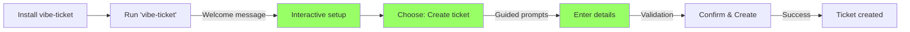

# User Journey Maps for vibe-ticket

## Journey 1: First-Time User Creating a Ticket

### Current Journey (Pain Points)


**Pain Points:**
- No onboarding experience
- Complex command syntax
- Multiple attempts needed
- High cognitive load

### Improved Journey (With UX Enhancements)


**Improvements:**
- Interactive onboarding
- Guided creation process
- Immediate success
- Low cognitive load

## Journey 2: Developer Working on a Feature

### Current Journey
```
1. Remember ticket ID/slug
2. Run: vibe-ticket start <ticket>
3. Manually create branch
4. Work on feature
5. Remember to update ticket status
6. Create PR manually
7. Close ticket manually
```

**Time:** ~15 minutes overhead
**Error Points:** 3-4 potential mistakes

### Improved Journey
```
1. Run: vibe-ticket work-on
   → Shows list of assigned tickets
   → Select from list
2. Automatic:
   → Creates branch
   → Updates status
   → Sets up worktree
3. Work on feature
4. Run: vibe-ticket finish
   → Creates PR
   → Links to ticket
   → Updates status
```

**Time:** ~2 minutes overhead
**Error Points:** 0-1 potential mistakes

## Journey 3: Project Manager Reviewing Progress

### Current Journey
```bash
# Multiple commands needed
vibe-ticket list --status open
vibe-ticket list --status doing
vibe-ticket list --status review
vibe-ticket show <each-ticket-id>
# Manual correlation of information
```

### Improved Journey
```bash
# Single command with rich output
vibe-ticket dashboard
# or
vibe-ticket report weekly

# Interactive filtering
vibe-ticket review --interactive
```

## Journey 4: Bug Reporter

### Current Journey
1. Figure out command structure
2. Create ticket with minimal info
3. Realize missing information
4. Edit ticket multiple times
5. Inconsistent bug reports

### Improved Journey
1. Run: `vibe-ticket report bug`
2. Guided template:
   - Steps to reproduce
   - Expected behavior
   - Actual behavior
   - Environment
   - Screenshots (if applicable)
3. Automatic validation
4. Consistent, complete bug reports

## Journey 5: Team Lead Planning Sprint

### Current Journey
```
- Manually create multiple tickets
- Copy-paste similar content
- Manually set priorities
- Manually assign team members
- No batch operations
```

### Improved Journey
```
- Use sprint planning template
- Bulk import from CSV/Markdown
- Auto-suggest priorities based on history
- Team member workload visualization
- Batch operations support
```

## Common Patterns Across Journeys

### Pain Points
1. **High Initial Learning Curve**
   - Complex command syntax
   - No guided experience
   - Poor error messages

2. **Repetitive Manual Tasks**
   - No automation
   - No templates
   - No batch operations

3. **Context Switching**
   - Multiple commands for single workflow
   - Manual correlation of information
   - Lost context between commands

### Solutions
1. **Progressive Disclosure**
   - Start simple, reveal complexity
   - Interactive mode by default
   - Advanced flags for power users

2. **Workflow Automation**
   - Single commands for complete workflows
   - Automatic state transitions
   - Smart defaults

3. **Context Preservation**
   - Stateful operations
   - Related actions grouped
   - Clear feedback and next steps

## Personas and Their Journeys

### Beginner Developer
- **Primary Journey**: Creating first ticket
- **Key Need**: Guidance and learning
- **Solution**: Interactive mode with tutorials

### Senior Developer
- **Primary Journey**: Efficient ticket management
- **Key Need**: Speed and automation
- **Solution**: Workflow commands and shortcuts

### Project Manager
- **Primary Journey**: Progress tracking and reporting
- **Key Need**: Visibility and control
- **Solution**: Dashboard and reporting tools

### DevOps Engineer
- **Primary Journey**: Automation and integration
- **Key Need**: Scriptability and consistency
- **Solution**: Structured output and batch operations

## Success Metrics for Each Journey

| Journey | Current Time | Target Time | Current Errors | Target Errors |
|---------|-------------|-------------|----------------|---------------|
| First ticket | 10 min | 2 min | 3-4 | 0-1 |
| Feature work | 15 min | 2 min | 3-4 | 0-1 |
| Progress review | 20 min | 5 min | 1-2 | 0 |
| Bug report | 8 min | 3 min | 2-3 | 0 |
| Sprint planning | 45 min | 15 min | 5-6 | 1-2 |

## Implementation Roadmap

### Phase 1: Foundation (Weeks 1-2)
- Interactive mode for basic commands
- Welcome experience for new users
- Basic templates

### Phase 2: Workflows (Weeks 3-4)
- Workflow commands (work-on, finish)
- State automation
- Context preservation

### Phase 3: Advanced (Weeks 5-6)
- Dashboard and reporting
- Batch operations
- Integration improvements

## Next Steps

1. Prioritize journeys based on user frequency
2. Design detailed interactions for each journey
3. Implement incrementally with user feedback
4. Measure improvement against baselines