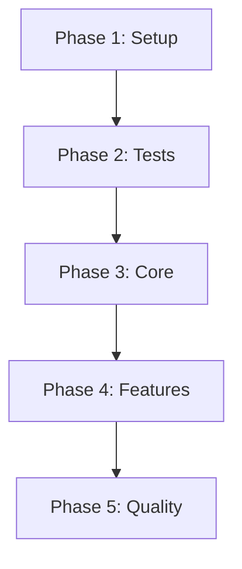

# Tasks: {{title}}

**Input**: Design documents from `{{spec_dir}}`  
**Prerequisites**: plan.md, research.md, data-model.md  
**Generated**: {{generated_date}}

## Execution Plan

### Phase Ordering
```
Phase 1: Setup → Phase 2: Tests → Phase 3: Core → Phase 4: Features → Phase 5: Quality
```

### Parallel Execution Strategy
Tasks marked with [P] can be executed in parallel within their phase.

---

## Phase 1: Setup & Infrastructure

### 1.1 Project Initialization
- [ ] **T001** Create project structure
- [ ] **T002** [P] Initialize version control
- [ ] **T003** [P] Set up development environment
- [ ] **T004** Configure build system
- [ ] **T005** Install dependencies

### 1.2 Configuration
- [ ] **T006** [P] Configure linting and formatting
- [ ] **T007** [P] Set up environment variables
- [ ] **T008** Create configuration files

## Phase 2: Test Infrastructure (TDD)

### 2.1 Test Setup
- [ ] **T009** Configure test framework
- [ ] **T010** [P] Create test utilities
- [ ] **T011** [P] Set up test data fixtures

### 2.2 Test Creation
- [ ] **T012** Write unit test stubs
- [ ] **T013** [P] Create integration test structure
- [ ] **T014** [P] Define acceptance tests

## Phase 3: Core Implementation

### 3.1 Data Layer
- [ ] **T015** Implement data models
- [ ] **T016** [P] Create validation logic
- [ ] **T017** [P] Set up data persistence

### 3.2 Business Logic
- [ ] **T018** Implement core services
- [ ] **T019** [P] Create business rules
- [ ] **T020** [P] Add error handling

### 3.3 API Layer
- [ ] **T021** Define API contracts
- [ ] **T022** [P] Implement endpoints
- [ ] **T023** [P] Add authentication

## Phase 4: Features

### 4.1 User Features
{{user_features}}

### 4.2 System Features
{{system_features}}

## Phase 5: Quality & Deployment

### 5.1 Testing
- [ ] **T030** Run unit tests
- [ ] **T031** [P] Execute integration tests
- [ ] **T032** [P] Perform acceptance testing
- [ ] **T033** Security testing
- [ ] **T034** Performance testing

### 5.2 Documentation
- [ ] **T035** [P] Write user documentation
- [ ] **T036** [P] Create API documentation
- [ ] **T037** Generate code documentation

### 5.3 Deployment
- [ ] **T038** Prepare deployment scripts
- [ ] **T039** Configure CI/CD
- [ ] **T040** Deploy to staging
- [ ] **T041** Deploy to production

---

## Task Dependencies



## Acceptance Criteria
{{acceptance_criteria}}

## Notes
- Update task status as work progresses
- Tasks can be exported to tickets for team collaboration
- Review and adjust task granularity as needed

---
Generated on: {{generated_date}}
